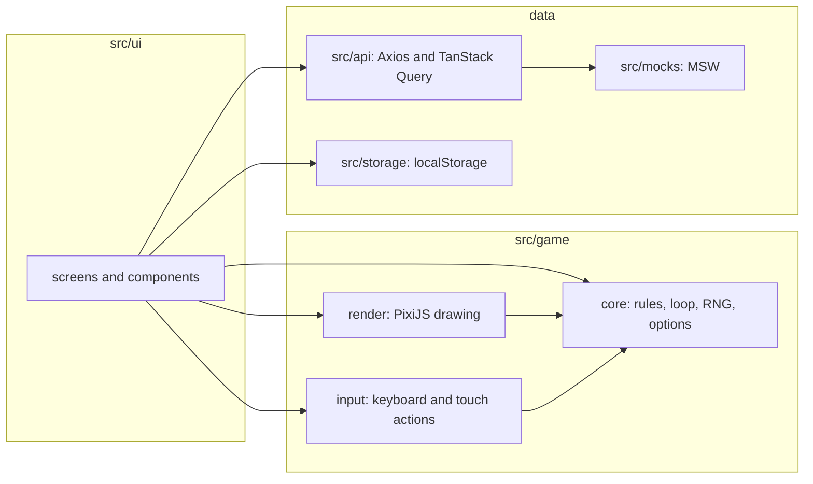

# Architecture

## 1. Overview

The code has three layers and one rule: **`src/game` never imports from `src/ui`**.

- `src/game/core` is a pure simulation: `updateGame(state, dt, input)` changes a plain state object. It has no React, no Pixi and no DOM, so it is tested directly.
- `src/game/render` reads the state and draws it with PixiJS. It never decides a rule.
- `src/game/input` turns keys and touch buttons into actions (`forward`, `rotateLeft`, `fireFront`...). The simulation only asks "is this action active?".
- `src/ui` holds the React screens (menu, options, match, result) and the HUD.
- `src/api`, `src/mocks` and `src/storage` hold ranking and history, the mocked server and local persistence.

## 2. React and PixiJS integration

`GameScreen` owns the Pixi `Application` inside one `useEffect`. The effect creates the application, loads the textures, starts the loop and returns a cleanup that stops the loop, removes the keyboard listeners, clears timers and destroys the application.

- **Strict Mode:** effects run twice in development. The effect keeps a `disposed` flag: if cleanup happens while the application is still initializing, it destroys the application as soon as it is ready and returns before touching the DOM.
- **React is not re-rendered every frame.** The loop writes to a HUD snapshot (`hp`, `score`, `secondsLeft`) with a functional `setHud` that returns the previous object when nothing changed, so React renders only when a visible value changes.
- The canvas is scaled to the window with CSS (`object-fit: contain`) while the game keeps a fixed 1280x720 coordinate space; the Pixi resolution follows `devicePixelRatio`.
- React reaches the game through callbacks (`onFinish`) and refs to the loop and the input; the game never calls React.

## 3. Simulation cycle

`GameLoop` runs on `requestAnimationFrame`:

1. It computes `dt` in seconds and clamps it (`maxDt` = 0.05 s) so a long pause or a hidden tab does not make the simulation jump.
2. If not paused, it calls `update(dt)` (rules) and then `render(dt)` (drawing).
3. Pausing sets the paused flag and resets the last timestamp, so the paused time never becomes a big `dt`.

Other details:

- All timers in the rules (cooldowns, spawn timer, match time) advance with `dt`, so pausing suspends them with no extra code. The match time counts only active play.
- **Seeded randomness:** `createRng(seed)` (mulberry32) feeds spawn positions and enemy types. `?seed=` makes a match repeatable for tests.
- **Pause:** `Esc`/`P`, window blur and a hidden tab pause. While paused the input is disabled and its held keys are cleared, so no movement or shot is accumulated; resuming needs a player action (the Resume button).
- **Test control:** `GameLoop.advance(seconds)` runs the simulation in fixed steps without drawing every frame and draws once at the end. It is exposed to the page only when the URL has `?testControls`.
- **Events:** each `updateGame` call starts with an empty `state.events` list and the rules append `shot`, `hit` and `explosion` events. The renderer turns them into effects, so the rules never depend on how things look.

## 4. Collisions

Ships are circles, projectiles are points and each island is a union of axis-aligned rectangles (`Island { rects }`). `geometry.ts` holds the helpers: `circlesOverlap`, `pushOutOfCircle`, `pointInIsland`, `circleOverlapsIsland` and `pushOutOfIsland`. The last one runs two passes, so a ship in the corner between two rectangles ends outside both. The drawn coast has wavy edges, but that is only visual (at most 7 px): collisions always use the exact rectangles.

Order of each update:

1. Move the player (turn, forward), push it out of islands, keep it inside the arena.
2. Cooldowns and player shots (front: 1 projectile, broadsides: 3 parallel projectiles).
3. Advance projectiles; remove those that expired, left the arena or hit an island (player and enemy projectiles use the same function; fort shots ignore islands).
4. Player projectiles against enemies: each projectile damages once and disappears; enemies with no health are removed and score.
5. Spawn and move enemies (Chasers and Shooters steer around islands and are pushed out of them); Shooters fire when in range.
6. Fort cannon: once the score reaches 5 it fires a slow shot at the player every 3 seconds.
7. Enemies touching the player: the enemy explodes and damages the player (no score).
8. Enemy projectiles against the player.
9. Update the match time and finish the match when the time is over or the ship has no health.

**Enemy steering.** `steerAround` probes two points ahead of the ship. If one is inside an island, it tries growing turn angles, first on the side the enemy already chose (`enemy.avoid`) and then on the other, so it does not zigzag. Spawn points keep `spawn.minDistanceFromIslands` (70 px) of clearance from every island.

## 5. Resource management

- Textures are loaded once per `GameScreen` mount (ship atlas parsed from XML, tile sheet) and reused; loading shows progress and a failure shows an error with **Try again**.
- Enemy sprites are kept in a list that grows and shrinks with the enemies; removed sprites are destroyed. Effect sprites are destroyed when their animation ends and at most 60 effects exist at once.
- Projectiles are not sprites: one `Graphics` object is cleared and redrawn each frame.
- Cleanup stops the loop, detaches keyboard listeners, clears the death-delay timer and destroys the Pixi application with its children. The performance run checks that no `<canvas>` is left in the page after each start/play/exit cycle.

## 6. Local persistence

| Key | Content |
|---|---|
| `pirate-battle:options` | Session time and spawn interval (validated and clamped on read) |
| `pirate-battle:player-id` | Player name: a generated `Pilot-1a2b3c4d` until the player types one in the menu (up to 16 characters). It is the id used by the ranking and the history. In-memory fallback when storage is blocked |
| `pirate-battle:pending-matches` | Matches not yet confirmed by the API |
| `pirate-battle:mock-matches` | Matches registered in the mock API |
| `pirate-battle:mock-scenario` | Scenario chosen in the menu |

Every read is wrapped in `try/catch` and falls back to defaults when storage is blocked or the JSON is invalid. There is no version field yet: an unknown shape is replaced by the defaults.

## 7. Ranking and history

- **Contract:** a `MatchRecord` has `id`, `playerId`, `playedAt`, `score`, `durationSeconds`, `reason` (`time` or `destroyed`) and the `config` used. Lists return `{ items, total, page, pageSize }`.
- **Ranking rules** (`rankRecords`): only matches with the same options; score descending; ties are broken by the earlier date and then by `id`, so the order is deterministic. Pagination is 10 items per page.
- **Client:** an Axios instance (`baseURL: /api`, timeout 5 s) and typed functions. TanStack Query keys include the page and the options (`["ranking", config, page]`, `["history", playerId, page]`), so an older answer can never overwrite the page the player is looking at; `keepPreviousData` avoids flicker while changing pages. Queries retry twice and show loading, empty and error states.
- **Registering a match:** the match gets a UUID when it starts. When it ends it is added to `pending-matches` **before** the request is sent, then sent with `useMutation` (2 retries). On success it is removed from the pending list and the ranking and history queries are invalidated, so both tabs refresh.
- **Idempotency:** the server ignores a match whose `id` already exists and answers with the saved one, so a retry after a timeout never creates a second entry (scenario `timeout-after-register`).
- **Pending matches survive failures and reloads:** they are sent again when the app opens and on the browser `online` event. The player can start another match while one is pending, and API failures never block the game.

## 8. Balancing decisions

The values in `gameConfig.ts` were set by hand and tuned by playing; they are a starting point, not a measured balance.

- The ship (220 px/s) is faster than a Chaser (110 px/s) and a Shooter (80 px/s), so the player can always run away and shoot while sailing.
- Projectiles (500 px/s, 1.5 s, about 750 px) reach well beyond the Shooter's range (320 px), so the player can answer from a distance.
- A Shooter's shot (5) is weaker than a Chaser's crash (10), because it can be avoided while the crash cannot be undone.
- Broadsides (3 shots, 1 s cooldown) deal more damage per second than the front cannon (1 shot, 0.4 s) but need the ship to be side on, which is the trade-off between the two weapons.
- At most 8 enemies at once and a minimum spawn distance of 300 px keep the arena readable and give a moment to react.

## 9. Known limitations

- Sound is simple: game events map to the delivered files, with no mixing or positional audio.
- The balance was tuned by feel only; there is no automatic difficulty curve.
- Enemies appear only on the left and right edges of the arena.
- The mock API lives in the browser: the ranking shows fixed players plus the matches registered in the same browser.
- The visual regression images are for Windows; other systems need `--update-snapshots`.
- The performance run uses a simple scripted pilot that is destroyed quickly, so the entity counts are lower than in a long human match. GPU memory is not measured.
- The production bundle is about 980 kB (PixiJS) and gets a size warning from Vite; code splitting was not done.
- The player name is also the player id, so two people typing the same name share a history, and changing the name starts a new history. That is acceptable for a mocked API.
